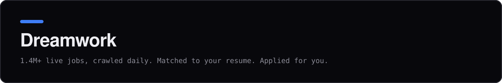

  Dreamwork is an autonomous job-application agent. It crawls 400,000+ live listings directly from company career pages, matches them against your resume, and can tailor and submit applications for you.

  <a href="https://www.dreamworkhq.com/?utm_source=github&utm_medium=org_profile">dreamworkhq.com</a>
  ·
  <a href="https://www.dreamworkhq.com/blog?utm_source=github&utm_medium=org_profile">Blog</a>
  ·
  <a href="https://www.dreamworkhq.com/how-to?utm_source=github&utm_medium=org_profile">How-to guides</a>
  ·
  <a href="https://www.dreamworkhq.com/research?utm_source=github&utm_medium=org_profile">Hiring research</a>
  ·
  <a href="https://www.npmjs.com/package/@dreamworkhq/mcp">MCP server</a>

### Daily job lists

Each repo updates once a day from Dreamwork's public listings API:

- [AI-ML-Jobs](https://github.com/dreamworkhq/AI-ML-Jobs): AI-first and AI-focused roles, labeled by a classifier that reads each posting
- [New-Grad-Software-Engineer-Jobs](https://github.com/dreamworkhq/New-Grad-Software-Engineer-Jobs): entry-level US software, data, and security roles
- [Remote-Tech-Jobs](https://github.com/dreamworkhq/Remote-Tech-Jobs): fully remote engineering roles worldwide
- [Tech-Internships-2026](https://github.com/dreamworkhq/Tech-Internships-2026): US tech internships across software, data, product, and design
